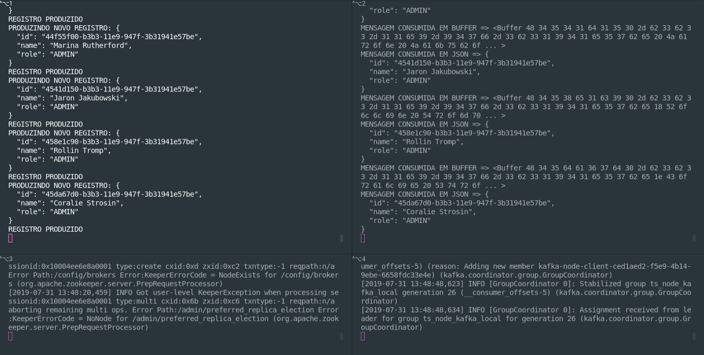

# Typescript, Node e Kafka: exemplo

Exemplo da palestra "Typescript, Node e Kafka: combinação escalável"

## Resultado final



## Executando o projeto em DEV

### Instalação

Instale as dependências com o comando

```bash
npm i
```

Caso queria você pode rodar o `npm ci` para fazer a leitura direto do `package-lock.json`.

### Execução

Inicie o servidor Kafka e o ZooKeeper em terminais separados (para saber como instalar veja a documentação aqui: https://kafka.apache.org/quickstart)

ZooKeeper
```bash
bin/zookeeper-server-start.sh config/zookeeper.properties
```

Kafka
```bash
bin/kafka-server-start.sh config/server.properties
```

Crie o tópico:

```bash
bin/kafka-topics.sh --create --bootstrap-server localhost:9092 --replication-factor 1 --partitions 1 --topic ts_node_kafka_topic_2
```

Inicie o produtor e o consumidor
```bash
npm run producer
npm run consumer
```

## Slides

Os slides da palestra estão nesse link: https://slides.com/gsaless/node-typescript-kafka
